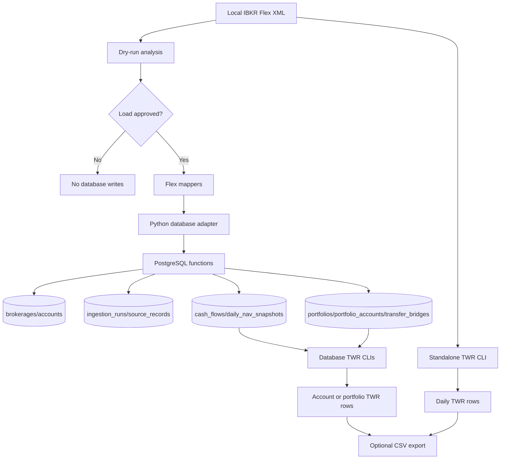

# Architecture

SuperFolio is currently a Python-first portfolio data engine with a PostgreSQL persistence boundary. The planned TypeScript dashboard and API are roadmap items, not implemented application code.

## Implemented components

| Component | Location | Responsibility |
| --- | --- | --- |
| Flex XML parsers | `portfolio_engine/flex_xml.py` | Parse `CashTransaction` and `EquitySummaryByReportDateInBase` records for local TWR calculation. |
| Ingestion mappers | `portfolio_engine/ingestion/flex_mappers.py` | Convert supported Flex XML records into bulk JSON payloads for database functions. |
| Dry-run analysis | `portfolio_engine/ingestion/dry_run.py` | Inspect Flex XML safely, summarize supported records, and omit sensitive values from dry-run output. |
| Ingestion CLI | `portfolio_engine/ingestion_cli.py` and `scripts/ingest_flex_file.py` | Preview or load supported manual Flex XML records. |
| Account CLI | `portfolio_engine/account_cli.py` and `scripts/register_account.py` | Register brokerage accounts before ingestion. |
| Database adapter | `portfolio_engine/database.py` | Wrap PostgreSQL function calls behind a Python boundary. |
| TWR engine | `portfolio_engine/twr.py` and `scripts/calculate_twr.py` | Align cash flows to NAV dates and calculate daily linked time-weighted return. |
| Database TWR CLIs | `portfolio_engine/db_twr.py`, `portfolio_engine/portfolio_db_twr.py`, `scripts/calculate_twr_from_db.py`, and `scripts/calculate_portfolio_twr_from_db.py` | Calculate account-level and portfolio-level TWR from normalized PostgreSQL facts. |
| Portfolio management | `portfolio_engine/portfolio_cli.py`, `portfolio_engine/portfolio_twr.py`, and `scripts/manage_portfolio.py` | Create logical portfolios, attach accounts, create transfer bridges, and aggregate member account performance. |
| Automation | `portfolio_engine/automation/`, `scripts/run_automated_ingestion.py`, `scripts/manage_integration_connections.py`, and `.github/workflows/manual-ingestion.yml` | Configure encrypted IBKR Flex Web Service credentials, resolve targets, and run manual automated ingestion jobs. |
| Migrations | `migrations/` | Manage PostgreSQL tables and functions with Sqitch. |

## Data flow

## Boundaries

- Raw broker records and normalized portfolio tables are separate. `source_records` deduplicates broker-origin records before rows are written to `cash_flows` or `daily_nav_snapshots`.
- Application code should call `portfolio_engine.database.SuperFolioDatabase` instead of writing SQL directly.
- Database mutations should go through PostgreSQL functions defined by Sqitch migrations.
- `scratch/` is private local storage for Flex samples and is ignored by Git.

## Implemented vs planned

Implemented today:

- Local TWR calculation from Flex XML.
- Manual account registration.
- Manual Flex XML dry-run and database load.
- PostgreSQL schema and function boundary for the MVP ingestion model.
- Portfolio creation, account attachment, transfer bridges, and portfolio-level database TWR.
- Manual GitHub Actions automation, multi-login credential setup, and IBKR Flex Web Service ingestion.

Planned but not present as application code:

- Next.js dashboard and API routes.
- Scheduled GitHub Actions automation.
- Public dashboard hosting.
- Attribution, trade feed, and multi-broker expansion.
