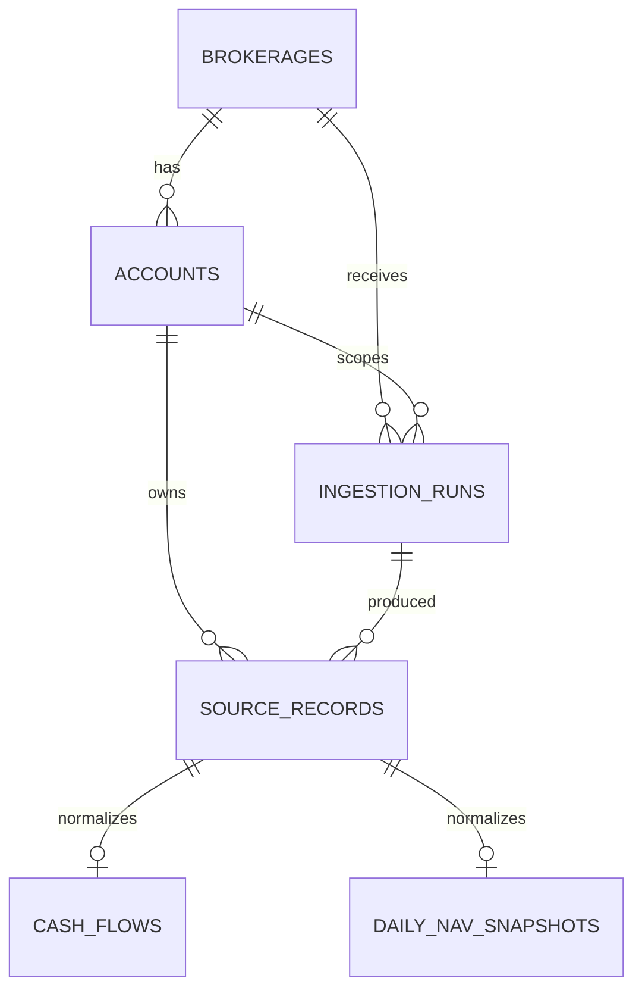

# Database Schema

This document describes the MVP PostgreSQL schema deployed by `migrations/deploy/create_mvp_schema.sql`. The schema stores account-scoped IBKR Flex ingestion data, deduplicates broker-origin records, and keeps raw source records separate from normalized portfolio facts.

## Relationship overview

## Tables

### `brokerages`

Stores supported brokerage integrations. The seed data inserts `IBKR` with import format `IBKR_FLEX_XML`.

Key constraints:

- `code` is unique and non-blank.
- `name` and `import_format` are non-blank.
- `is_active` allows an integration to be disabled without deleting history.

### `accounts`

Stores registered brokerage accounts. Every ingestion run is scoped to one active account.

Key constraints:

- `UNIQUE (brokerage_id, external_id)`.
- `external_id` and `account_type` are non-blank.
- `base_currency` must be an uppercase three-letter currency code.

### `ingestion_runs`

Tracks each ingestion attempt for one brokerage account.

Key constraints:

- `account_id` is a required foreign key to `accounts(id)`.
- `source_type` must be `FLEX_WEB_SERVICE` or `MANUAL_FILE`.
- `status` must be `pending`, `running`, `succeeded`, `partially_succeeded`, or `failed`.
- Date ranges must be ordered when both ends are present.
- Completed runs must have `completed_at >= started_at`.

### `source_records`

Stores unique broker-origin records and acts as the deduplication layer.

Key constraints:

- `UNIQUE (brokerage_id, dedupe_key)`.
- `record_type` must be `CASH_TRANSACTION` or `DAILY_NAV`.
- `dedupe_key` is non-blank.
- `source_currency` must be uppercase when present.

### `cash_flows`

Stores normalized external cash movements from supported `CashTransaction` records.

Key constraints:

- `source_record_id` is unique, preserving a one-to-one source-to-normalized relationship.
- `cash_flow_type` is non-blank.
- `currency` must be uppercase.
- `fx_rate_to_base` must be positive when present.

### `daily_nav_snapshots`

Stores one canonical daily NAV value per account/date.

Key constraints:

- `source_record_id` is unique.
- `UNIQUE (account_id, snapshot_date)` prevents conflicting canonical NAV rows.
- `base_currency` must be uppercase.

## Deduplication model

`ingestion_runs` records the ingestion attempt. `source_records` records unique broker-origin rows. This separation lets scheduled pulls, manual backfills, and overlapping Flex files safely contain the same broker records.

Cash-flow dedupe keys prefer IBKR `transactionID` when present. Daily NAV dedupe keys use brokerage, account, record type, and report date.

## Supporting indexes

- `source_records_account_id_idx`
- `source_records_ingestion_run_id_idx`
- `cash_flows_account_flow_date_idx`
- `ingestion_runs_brokerage_started_at_idx`
