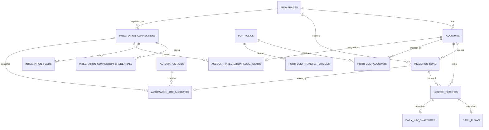

# Database Schema

This document describes the PostgreSQL schema deployed across three migrations: `migrations/deploy/create_mvp_schema.sql` (account registration, ingestion runs, source records, cash flows, and daily NAV snapshots), `migrations/deploy/create_portfolio_layer.sql` (portfolios, portfolio accounts, and transfer bridges), and `migrations/deploy/create_automation_layer.sql` (automation jobs and per-account job outcomes). The schema stores account-scoped IBKR Flex ingestion data, deduplicates broker-origin records, keeps raw source records separate from normalized portfolio facts, supports logical portfolio groupings across multiple accounts, tracks parent automation job lifecycle and per-account outcomes for manual and future scheduled ingestion runs, and models multi-login credential and feed configuration with per-account connection assignments.

## Relationship overview

## Tables

### `brokerages`

Stores supported brokerage integrations. The seed data inserts `IBKR` with import format `IBKR_FLEX_XML`.

Key constraints:

- `code` is unique and non-blank.
- `name` and `import_format` are non-blank.
- `is_active` allows an integration to be disabled without deleting history.

### `accounts`

Stores registered brokerage accounts. Every ingestion run is scoped to one active account.

Key constraints:

- `UNIQUE (brokerage_id, external_id)`.
- `external_id` and `account_type` are non-blank.
- `base_currency` must be an uppercase three-letter currency code.

### `ingestion_runs`

Tracks each ingestion attempt for one brokerage account.

Key constraints:

- `account_id` is a required foreign key to `accounts(id)`.
- `source_type` must be `FLEX_WEB_SERVICE` or `MANUAL_FILE`.
- `status` must be `pending`, `running`, `succeeded`, `partially_succeeded`, or `failed`.
- Date ranges must be ordered when both ends are present.
- Completed runs must have `completed_at >= started_at`.

### `source_records`

Stores unique broker-origin records and acts as the deduplication layer.

Key constraints:

- `UNIQUE (brokerage_id, dedupe_key)`.
- `record_type` must be `CASH_TRANSACTION` or `DAILY_NAV`.
- `dedupe_key` is non-blank.
- `source_currency` must be uppercase when present.

### `cash_flows`

Stores normalized external cash movements from supported `CashTransaction` records.

Key constraints:

- `source_record_id` is unique, preserving a one-to-one source-to-normalized relationship.
- `cash_flow_type` is non-blank.
- `currency` must be uppercase.
- `fx_rate_to_base` must be positive when present.

### `daily_nav_snapshots`

Stores one canonical daily NAV value per account/date.

Key constraints:

- `source_record_id` is unique.
- `UNIQUE (account_id, snapshot_date)` prevents conflicting canonical NAV rows.
- `base_currency` must be uppercase.

### `portfolios`

Stores saved portfolio calculation/view definitions. A portfolio has a unique name used as its lookup key, a reporting currency, an active flag, and references brokerage accounts through `portfolio_accounts`.

### `portfolio_accounts`

Stores many-to-many membership between portfolios and brokerage accounts. An account can belong to multiple portfolios when its base currency matches the portfolio reporting currency. Inactive accounts still contribute historical data when they are members.

### `automation_jobs`

Stores one user-triggered or future scheduled automation operation. Manual jobs require a requested start and end date, record the target type (`portfolio` or `accounts`), selected integration, mode (`dry-run` or `load`), status, sanitized parent summary, and sanitized error message.

### `automation_job_accounts`

Stores the resolved account snapshot for one automation job. Each row tracks account-level status, optional linked `ingestion_runs.id` for load mode, sanitized child summary counts, sanitized error message, and a `connection_id` snapshot that records which integration connection was assigned to the account at the time the job ran.

For load mode, active pending or running load jobs for the same integration and account whose requested date range overlaps the new job's range block new load attempts. The parent `automation_jobs` row and all child `automation_job_accounts` rows are created first; overlap is then evaluated per-account during execution by `has_overlapping_automation_load`, which excludes the current job id from the check. Accounts found to overlap are set to `failed` with `error_category="overlapping_load_job"` in the child summary JSON.

### `integration_connections`

Stores one named broker login per integration type. Each connection is scoped to a single brokerage and integration key, and carries a display name that distinguishes multiple logins for the same brokerage.

Key constraints:

- `UNIQUE (brokerage_id, integration_key, name)` prevents duplicate named connections.
- `integration_key` and `name` must be non-blank.
- `is_active` allows a connection to be disabled without deleting its credential or feed history.

### `integration_connection_credentials`

Stores encrypted credentials for an integration connection. Each active credential row holds a ciphertext encrypted with the `SUPERFOLIO_CREDENTIAL_MASTER_KEY` Fernet key, the key id used for encryption, and the encryption version.

Key constraints:

- `UNIQUE (connection_id, credential_name) WHERE is_active = true` — at most one active credential per name per connection.
- `credential_name` and `encryption_key_id` must be non-blank.
- `encryption_version` must be positive.
- Rotating a credential deactivates the previous row (sets `is_active = false`, records `rotated_at`) and inserts a new active row.

### `integration_feeds`

Stores one named Flex query configuration per connection. Each feed has a `feed_key` that is unique within its connection and must not contain a colon character.

Key constraints:

- `UNIQUE (connection_id, feed_key)`.
- `feed_key` must be non-blank and contain no colon characters.
- `display_name` is optional.
- `is_active` allows a feed to be disabled without removing it.

### `account_integration_assignments`

Stores which integration connection is responsible for fetching data for each brokerage account. Each account has at most one active assignment at a time; re-assigning an account updates the existing row.

Key constraints:

- `account_id` is the primary key — one assignment per account.
- `connection_id` references `integration_connections(id)` and must belong to the same brokerage as the account.
- `is_active` tracks whether the assignment is currently effective.

### `portfolio_transfer_bridges` Source and destination accounts must both be portfolio members, bridge currency must match the portfolio reporting currency, and overlapping bridge windows for the same source/destination account pair are rejected.

## Deduplication model

`ingestion_runs` records the ingestion attempt. `source_records` records unique broker-origin rows. This separation lets scheduled pulls, manual backfills, and overlapping Flex files safely contain the same broker records.

Cash-flow dedupe keys prefer IBKR `transactionID` when present. Daily NAV dedupe keys use brokerage, account, record type, and report date.

## Supporting indexes

- `source_records_account_id_idx`
- `source_records_ingestion_run_id_idx`
- `cash_flows_account_flow_date_idx`
- `ingestion_runs_brokerage_started_at_idx`
- `integration_connection_credentials_active_unique` (partial unique: active credential per name per connection)
- `integration_connection_credentials_connection_id_idx`
- `account_integration_assignments_connection_id_idx`
- `automation_job_accounts_connection_id_idx`
