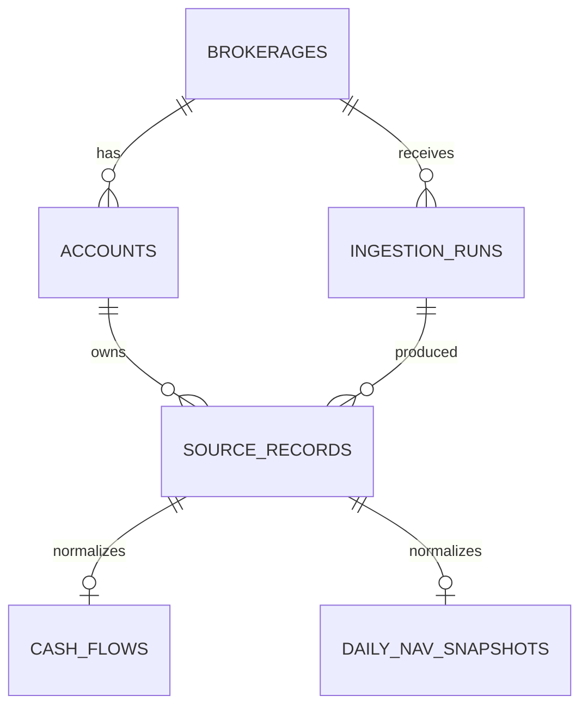
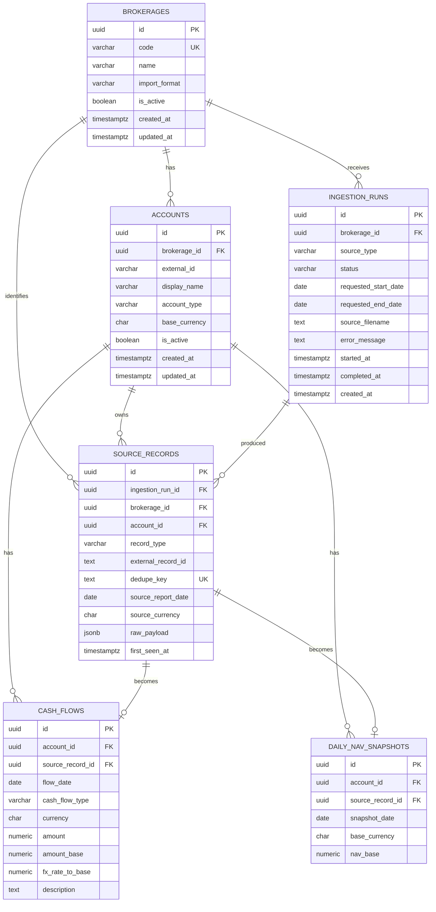

# MVP Database Entity Relationship Diagram

This document captures the MVP database structure for SuperFolio. The MVP ingests Interactive Brokers Flex data, deduplicates overlapping source records, and stores only the data needed for daily NAV tracking plus external cash deposits and withdrawals.

## Relationship overview

## Detailed ERD

## Tables

### `brokerages`

Stores supported brokerage integrations. The MVP starts with IBKR, but the table is designed so later brokerage integrations can be added without changing account or portfolio tables.

| Column | Purpose |
| --- | --- |
| `id` | Internal primary key. |
| `code` | Stable machine-readable brokerage code, such as `IBKR`; unique. |
| `name` | Human-readable brokerage name. |
| `import_format` | Default data format/parser family, such as `IBKR_FLEX_XML`. |
| `is_active` | Allows an integration to be disabled without deleting history. |
| `created_at`, `updated_at` | Audit timestamps. |

### `accounts`

Stores individual accounts at brokerages. Currency belongs here because account base currency can vary even within the same brokerage.

| Column | Purpose |
| --- | --- |
| `id` | Internal primary key. |
| `brokerage_id` | Brokerage that owns this account. |
| `external_id` | Broker-assigned account identifier from the source data. |
| `display_name` | Optional user-friendly label for UI display. |
| `account_type` | Freeform account classification, such as margin, TFSA, RRSP, or individual. |
| `base_currency` | ISO 4217 account/reporting currency, such as `CAD` or `USD`. |
| `is_active` | Allows closed or inactive accounts to remain in history. |
| `created_at`, `updated_at` | Audit timestamps. |

Recommended constraint: `UNIQUE (brokerage_id, external_id)`.

### `ingestion_runs`

Tracks each ingestion attempt. This table records where data came from and whether processing succeeded; it is not responsible for deduplicating broker events.

| Column | Purpose |
| --- | --- |
| `id` | Internal primary key. |
| `brokerage_id` | Brokerage whose data was ingested. |
| `source_type` | Ingestion transport, initially `FLEX_WEB_SERVICE` or `MANUAL_FILE`. |
| `status` | Run lifecycle status, such as `pending`, `running`, `succeeded`, or `failed`. |
| `requested_start_date`, `requested_end_date` | Date range requested from the Flex query or represented by a manual backfill. |
| `source_filename` | Optional filename for manual XML imports; null for scheduled web-service runs. |
| `error_message` | Failure details when the run does not complete successfully. |
| `started_at`, `completed_at`, `created_at` | Run timing and audit timestamps. |

### `source_records`

Stores unique broker-origin records seen during ingestion. This table is the primary deduplication layer for overlapping Flex outputs.

| Column | Purpose |
| --- | --- |
| `id` | Internal primary key. |
| `ingestion_run_id` | Ingestion run where this source record was first seen. |
| `brokerage_id` | Brokerage namespace for the deduplication key. |
| `account_id` | Account associated with the source record. |
| `record_type` | Source record category, initially `CASH_TRANSACTION` or `DAILY_NAV`. |
| `external_record_id` | Broker-provided stable record identifier, when available. |
| `dedupe_key` | Deterministic fingerprint used to prevent duplicate broker events. |
| `source_report_date` | Report date carried by the broker source row. |
| `source_currency` | Currency from the source row, when applicable. |
| `raw_payload` | Parsed source attributes for audit and debugging, not app business logic. |
| `first_seen_at` | Timestamp when this unique source record was first persisted. |

Recommended constraint: `UNIQUE (brokerage_id, dedupe_key)`.

### `cash_flows`

Stores normalized external cash movements from IBKR `CashTransaction` rows.

| Column | Purpose |
| --- | --- |
| `id` | Internal primary key. |
| `account_id` | Owning brokerage account for this external cash movement. |
| `source_record_id` | One-to-one link to the deduplicated broker source record that produced this row. |
| `flow_date` | Date used by TWR calculations to align the cash flow with daily NAV. |
| `cash_flow_type` | Broker/app classification, such as deposit, withdrawal, transfer, dividend, or fee. |
| `currency` | Original transaction currency from the broker record. |
| `amount` | Cash-flow amount in the original transaction currency. |
| `amount_base` | Cash-flow amount converted into the account/base reporting currency. |
| `fx_rate_to_base` | FX rate used for the source-to-base conversion, if provided or needed. |
| `description` | Broker-provided description or memo for audit and debugging. |

Recommended constraint: `UNIQUE (source_record_id)`.

### `daily_nav_snapshots`

Stores one canonical daily NAV snapshot per account and valuation date from `EquitySummaryByReportDateInBase`.

| Column | Purpose |
| --- | --- |
| `id` | Internal primary key. |
| `account_id` | Brokerage account whose value is being snapshotted. |
| `source_record_id` | One-to-one link to the deduplicated broker source record that produced this row. |
| `snapshot_date` | Valuation date for this account snapshot. |
| `base_currency` | Account/reporting currency for the NAV value. |
| `nav_base` | Total account NAV/equity value in base currency for this date. |

Recommended constraints: `UNIQUE (source_record_id)` and `UNIQUE (account_id, snapshot_date)`.

## Deduplication model

`ingestion_runs` tracks ingestion attempts. It answers questions like: did the scheduled Flex Web Service job run, what range did it request, did it fail, and was a manual XML file used?

`source_records` tracks unique broker-origin rows. It answers: have we already seen this exact broker event or daily valuation?

This separation matters because Flex outputs can overlap. A scheduled pull, initial historical file, and manual missed-days backfill can all contain the same broker records. The importer should compute the same `dedupe_key` for the same broker event, upsert into `source_records`, and only create `cash_flows` or `daily_nav_snapshots` when a new source record is inserted.

For IBKR cash transactions, the dedupe key should prefer a broker-provided transaction identifier when available. If no stable external ID exists, the fallback fingerprint should be built from normalized source fields such as brokerage code, account external ID, record type, relevant dates, currency, amount, transaction type, and broker description.
